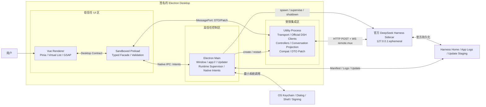
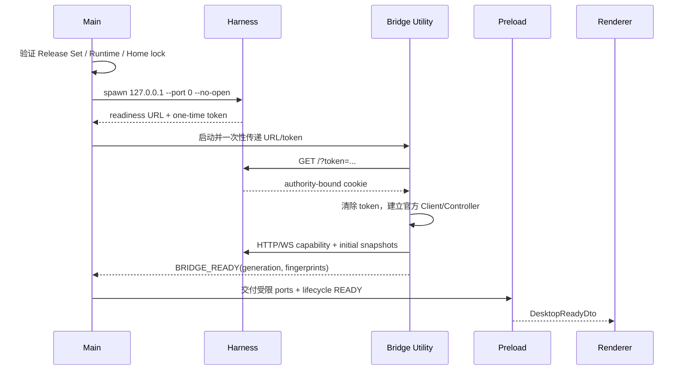

# 02｜总体架构与进程边界

> 模块编号：M02
> 功能前缀：`ARCH`
> 优先级：P0
> 核心决策：所有官方 DSH/Cordis/Controller/Conversation 投影只运行在 Utility Process

## 1. 模块目标

定义桌面应用的进程拓扑、信任边界、所有权、数据流、生命周期和故障隔离，使后续模块知道代码应该放在哪里、允许获得什么权限、可以通过什么接口通信，以及发生异常时由谁恢复。

该架构要同时实现：

- 使用官方 Harness 的完整 Client/Controller 语义。
- 将 alpha 上游变化隔离在 Bridge/Compat 内。
- 将 Renderer 维持为无 Node、无 Secret、无网络的纯 UI 环境。
- 让 Harness 和 Bridge 可以独立崩溃、重启和重新同步。
- 对高频流实施顺序、generation、背压和容量控制。
- 对系统权限建立最小化、声明式 Intent。

## 2. 范围与非范围

### 2.1 范围

- Electron Main、Preload、Utility、Renderer 和 Harness Sidecar 的职责。
- App 启动、认证、同步、命令、流事件、重连、退出和更新数据流。
- Desktop Port、Native IPC 和 Harness Transport 三类接口。
- 资源所有权、进程失败、重建策略和状态模型。
- 安全边界、容量边界和跨进程数据约束。

### 2.2 非范围

- 不定义具体视觉稿。
- 不展开每一个 Session/Tool DTO 字段；公共合同见 `04-工程骨架与公共合同.md`。
- 不实现 Harness 业务逻辑。
- 不允许 Renderer 直连 HTTP/WS 或动态加载官方 Client。
- V1 不设计远程 Harness、LAN、浏览器版或任意第三方 Renderer 插件。
- 不将 Utility 当作第二个 Main；它无权操作任意系统资源或管理窗口。

## 3. 架构总览



## 4. 进程责任矩阵

| 进程 | 信任等级 | 拥有的资源 | 允许 | 禁止 |
|---|---|---|---|---|
| Main | 最高 | Window、Protocol、Updater、Runtime Child、Bridge Child、Job Object、原生 Intent | 启停进程、验证制品、调用受控 OS 能力、协调更新 | 解析 Conversation、持有 Vue 状态、把 Secret 发给页面、执行模型生成命令字符串 |
| Preload | 受限桥梁 | ContextBridge facade、MessagePort 封装、订阅释放器 | 双向 Schema 校验、关联请求、暴露窄 API | 暴露 `ipcRenderer`、Node fs、Cookie、Token、任意 channel |
| Utility/Bridge | 高信任但无桌面权力 | CookieJar、HTTP/WS、Cordis Context、官方 Controller、投影、Compat、流缓冲 | 调用 Harness、生成 DTO/Patch、背压、重连、对账 | 打开任意窗口/外链、读取任意用户文件、使用 Electron UI API、把官方对象传给 Renderer |
| Renderer | 低信任 | Vue 组件、Pinia UI 状态、草稿、DOM、Worker、GSAP Timeline | 展示 DTO、提交声明式 Command/Intent、管理表现状态 | Node/Electron、网络、Secret、真实路径、官方 DSH/Cordis、业务日志持久化 |
| Harness Sidecar | 独立受监督服务 | Agent Runtime、Workspace/Session、Tools、官方持久化 | 只监听 loopback，按官方协议服务 | 直接控制 Renderer/Main、将启动 Token写入日志、由用户输入替换入口 |

## 5. 依赖规则

### 5.1 编译依赖方向

```text
desktop-contracts  ←  preload / bridge / renderer / main
       ↑
harness-compat     ←  bridge only
       ↑
official dsh-* / cordis

main    → desktop-contracts（不得依赖 bridge 实现）
preload → desktop-contracts（不得依赖 Vue 或官方包）
renderer→ desktop-contracts（不得依赖 Electron/Node/官方包）
bridge  → desktop-contracts + harness-compat + official packages
```

### 5.2 运行时依赖方向

- Main 创建 Bridge 和 Harness，但不代理每一条会话数据。
- Main 将一对 MessagePort 的一端交给 Preload/Renderer facade，另一端交给 Bridge。
- Preload 提供验证、订阅和调用语义，不让 Renderer 直接拿到底层端口对象。
- Bridge 是唯一 Harness 网络客户端。
- Harness 是 Workspace/Session/Agent 的唯一业务真源。

### 5.3 静态边界门禁

- ESLint/依赖图规则禁止 Renderer 导入 `electron`、Node builtin、`@deepseek-ai/dsh-*`、Cordis。
- Main/Preload 禁止导入官方 DSH Client。
- `harness-compat` 禁止导入 Vue、Pinia、Electron UI 模块。
- DTO 包不得含类实例、函数、Symbol、DOM、Error 原型或不可 structured-clone 数据。
- 发现循环依赖或越界导入时构建失败，不能只发 Warning。

## 6. 建议目录

```text
apps/desktop/src/
├─ main/
│  ├─ bootstrap/
│  ├─ windows/
│  ├─ protocol/
│  ├─ runtime-supervisor/
│  ├─ bridge-supervisor/
│  ├─ native-intents/
│  ├─ updater/
│  └─ diagnostics/
├─ preload/
│  ├─ expose-desktop-api.ts
│  ├─ desktop-port-client.ts
│  ├─ native-intent-client.ts
│  └─ validation/
├─ bridge/
│  ├─ bootstrap/
│  ├─ transport/
│  ├─ official-client/
│  ├─ projection/
│  ├─ facade/
│  ├─ backpressure/
│  └─ diagnostics/
└─ renderer/
   ├─ app/
   ├─ stores/
   ├─ features/
   ├─ components/
   ├─ workers/
   └─ motion/

packages/
├─ desktop-contracts/
├─ harness-compat/
├─ design-system/
├─ tool-presenters/
├─ render-workers/
└─ test-fixtures/
```

## 7. 核心状态和数据模型

### 7.1 桌面应用总状态

```ts
type DesktopLifecycle =
  | { kind: "COLD" }
  | { kind: "VERIFYING_RELEASE_SET" }
  | { kind: "STARTING_HARNESS"; attempt: number }
  | { kind: "STARTING_BRIDGE"; attempt: number }
  | { kind: "AUTHENTICATING" }
  | { kind: "SYNCHRONIZING"; generation: number }
  | { kind: "READY"; generation: number }
  | { kind: "DEGRADED"; generation: number; reason: string }
  | { kind: "RECOVERING"; fromGeneration: number; attempt: number }
  | { kind: "STOPPING"; reason: "QUIT" | "UPDATE" | "REPAIR" }
  | { kind: "STOPPED" }
  | { kind: "FATAL"; supportCode: string };
```

状态只由 Main 的协调器发布；Bridge 可以报告连接子状态，但不能自行宣称整个 App 已 Ready。

### 7.2 连接代际

```ts
type ConnectionEpoch = {
  appInstanceId: string;
  bridgeInstanceId: string;
  harnessInstanceId: string;
  generation: number;
  connectedAt: string;
  releaseSetId: string;
};
```

每次 Bridge 或 Harness 连接被重建时 `generation` 单调递增。所有命令、结果、Snapshot 和 Patch 都必须携带 generation；Renderer 丢弃旧 generation 数据。

### 7.3 资源所有权

| 资源 | 唯一创建者 | 唯一关闭责任人 | 崩溃兜底 |
|---|---|---|---|
| BrowserWindow | Main | Main | OS 回收 |
| Renderer subscription | Vue scope/Preload | Preload unsubscribe | Renderer 重建即失效 |
| MessagePort pair | Main | Main/Bridge 各关一端 | 进程退出自动断开，Supervisor 检测 |
| Cordis Context | Bridge | Bridge shutdown coordinator | Utility 退出回收 |
| HTTP/WS/CookieJar | Bridge | Bridge transport owner | Utility 退出回收，Cookie 不持久化 |
| Harness process | Main Runtime Supervisor | Runtime Supervisor | stdin EOF + Windows Job Object |
| Harness Home lock | Main/companion | Supervisor shutdown | 进程死亡后可验证地回收 |
| Worker/Observer/GSAP | Renderer component scope | 对应 scope | Renderer 销毁回收并有泄漏测试 |

## 8. 关键数据流

### 8.1 启动与认证



规则：

- readiness 原始行在进入通用日志前截获和脱敏。
- Renderer 不收到 URL、端口、Token、Cookie 或 Harness PID。
- Bridge 只有在协议、Capability、Controller 和初始快照全部就绪后报告 Ready。
- Main 必须比较 Bridge 报告与已验证 Release Set，不能盲信子进程。

### 8.2 普通命令

```text
用户动作
→ Vue feature 生成类型化 Command
→ Preload 校验 + requestId + deadline
→ Bridge 再校验 + capability + generation
→ 官方 Controller/Remote
→ CommandResult 或 Accepted
→ durable Snapshot/Patch 最终确认
```

- `CommandResult=Accepted` 不代表业务最终完成。
- 非幂等命令必须带 `clientCommandId`，但除非上游确认幂等，Bridge 不因断线自动重放。
- 超时只停止等待；是否取消远端业务由对应命令的专用 Cancel 决定。

### 8.3 高频流

```text
Harness WS frame
→ 官方 Client/Controller
→ Conversation projector
→ versioned Patch
→ Bridge bounded queue / coalescing
→ Preload closed-over MessagePort
→ Renderer generation + revision 校验
→ shallow state commit（每帧至多一次）
→ Vue render
```

不能丢弃的事件：最终文本、完成/失败、Approval、Question、Tool result、Session error、revision 边界。允许按规则合并的事件：同一个未完成文本或 Reasoning block 的连续 delta。

### 8.4 原生 Intent

```text
Renderer 声明意图（如 PICK_FILES / OPEN_EXTERNAL）
→ Preload Schema
→ Main sender + policy + user gesture 验证
→ OS API
→ opaque result / handle
```

Renderer 永远不能传入可执行文件、Shell 命令或无限制真实路径，让 Main 直接执行。

### 8.5 重连与重新同步

1. Bridge 检测 WS/HTTP/Controller 失效，停止发布普通 Patch。
2. Main 发布 `DEGRADED`，页面保留最后快照但禁用危险写操作。
3. Bridge 有界退避重连；若 Harness 进程死亡则由 Main 重启。
4. 建立新 generation，重新认证并构建官方 Client。
5. 对活动 Session 获取全量 Snapshot，并通过官方 journal 修复 Gap。
6. Bridge 发布 `RESET_SNAPSHOT(newGeneration)`。
7. Renderer 原子替换旧领域状态，清理旧交互和 provisional 节点。
8. Main 在所有必要领域同步完成后重新发布 `READY`。

### 8.6 退出

```text
Main STOPPING
→ Renderer 禁止新写操作并保存非敏感 UI 状态
→ Bridge 停止接受命令、取消订阅、关闭 Controller/WS
→ Harness lifecycle companion 收到 stdin EOF 并 drain
→ 等待 shutdown-complete / exit
→ 超时才终止受验证的进程树
→ 释放 Home lock
→ App 退出
```

更新退出比普通退出多出“当前任务确认、数据快照和 staging preflight”，但资源关闭顺序保持一致。

## 9. 接口边界

### 9.1 Desktop Port

用于 Renderer/Preload 与 Bridge 的领域数据：

```ts
type DesktopPortFrame =
  | { type: "request"; envelope: RequestEnvelope }
  | { type: "response"; envelope: ResponseEnvelope }
  | { type: "event"; envelope: EventEnvelope }
  | { type: "flow.credit"; credits: number; maxBytes: number }
  | { type: "flow.ack"; sequence: number }
  | { type: "control.resync"; domain: string; observedRevision: number };
```

具体 Payload 必须由 `desktop-contracts` 的封闭联合定义，禁止 `method:string + any`。

### 9.2 Native IPC

只允许窗口和系统能力，例如：

- `system.pickFiles`
- `system.pickDirectory`
- `system.openExternal`
- `system.revealFileHandle`
- `window.setState`
- `update.check`
- `update.install`
- `diagnostics.export`

每个 Channel 都必须校验 sender frame、Schema、用户手势和权限策略。

### 9.3 Harness Transport

只有 Bridge 可见：

- 一次性根 URL Token 交换。
- `/api/...` HTTP POST。
- `/api/remote.mux` WebSocket。
- 内存 CookieJar、Origin/Host 一致性和 loopback 校验。

不向外抽象通用 Fetch 或 WebSocket；Desktop Contract 表达领域意图而不是 Harness URL。

## 10. 架构功能合同

| ID | P | 行为 | 实现与接口 | 故障恢复与安全 | 测试要求 | Definition of Done |
|---|---|---|---|---|---|---|
| `ARCH-001` | P0 | 用户使用 UI 时无需知道五个进程边界 | 按本文件拓扑部署 Main/Preload/Bridge/Renderer/Harness | 任一进程失败由其所有者处理，不相互假装成功 | 进程拓扑 E2E、逐进程强杀 | 实际打包制品进程与责任矩阵一致 |
| `ARCH-002` | P0 | UI 无法直接调用 Harness 或互联网 | Renderer CSP `connect-src 'none'`；唯一领域通道为闭包 MessagePort facade | 任何直连尝试被阻断并记录安全事件 | DevTools fetch/WS、XSS payload 负向测试 | Renderer 无网络权限且功能仍完整 |
| `ARCH-003` | P0 | 官方 alpha 类型不会扩散到页面 | 全部官方 Client/Cordis/Controller/投影驻留 Bridge，输出 Desktop DTO/Patch | 官方对象无法 clone 时按兼容错误处理，不退回 raw object | 静态依赖、bundle scan、runtime payload validation | Renderer bundle 中不存在官方包或类型名依赖 |
| `ARCH-004` | P0 | 重连后旧事件不会覆盖新状态 | 所有 Envelope 带 appInstance/generation/revision | 旧代事件丢弃；revision 缺口触发 resync | 延迟旧帧、乱序、重复、跨代 fuzz | 1,000 次重连无跨代污染 |
| `ARCH-005` | P0 | 慢页面不会拖垮 Bridge 或耗尽内存 | credit/ack、bounded queue、可合并 delta、不可丢终态 | 超限时停止增量并发送 `RESYNC_REQUIRED` | 页面冻结、低 credit、大流量压力测试 | 队列字节/数量始终低于预算，恢复后状态正确 |
| `ARCH-006` | P0 | 模型内容无法调用桌面任意能力 | 原生能力使用封闭 Intent，Main 验证 sender/user gesture/policy | 未知 Intent 和恶意路径全部拒绝 | IPC fuzz、路径/URL/命令注入 | 没有通用 execute/read/write/open IPC |
| `ARCH-007` | P0 | App 退出不遗留 Harness 和 Tool 进程 | Main 是进程所有者；stdin lifecycle + Job Object + 有界强杀 | 只终止已验证 PID 树；不按进程名广泛杀进程 | 正常/强杀/更新/崩溃/超时退出测试 | 500 次退出后无孤儿且不误杀外部进程 |
| `ARCH-008` | P1 | 页面重载后当前 Session 可恢复 | Main/Bridge 保持；新 Renderer 请求当前 generation 全量 Snapshot | 旧订阅自动释放；草稿按非敏感策略恢复 | reload 20 次、流中 reload、Interaction 中 reload | Listener 不增长，数据和交互状态正确恢复 |
| `ARCH-009` | P1 | Bridge 崩溃不会使 App 永久冻结 | Main 监督 Utility，重启后建立新 generation 和 Controller | 有界重启；Crash Loop 进入 Recovery Mode | Utility 强杀、初始化失败、连续崩溃 | 恢复或给出明确不可恢复状态，无静默卡死 |
| `ARCH-010` | P1 | Harness 崩溃时用户知道写操作可能未知 | Main 检测 exit；Bridge pending request 统一结算 | 非幂等项返回 `OUTCOME_UNKNOWN`；新实例全量对账 | Prompt/Approval/Create 中途强杀 Harness | 不自动重复危险写入；最终 UI 与快照一致 |
| `ARCH-011` | P1 | 每个资源有且只有一个关闭责任人 | 使用 Scope/Owner 注册表和逆序 shutdown coordinator | dispose 幂等；超时记录 support code | double-dispose、partial-init、leak 测试 | 资源所有权表与代码注册完全一致 |
| `ARCH-012` | P1 | 系统能准确表达未就绪、降级和恢复 | Main 聚合 DesktopLifecycle，Renderer 只根据枚举状态开放动作 | 未知状态 fail closed；不由多个 Store 推导不同 Ready | 状态机单元/模型测试和全状态视觉测试 | 每条迁移合法，非法迁移被断言阻止 |
| `ARCH-013` | P1 | Session 流和原生命令互不阻塞 | 高频领域数据走 MessagePort，低频 Native Intent 走 Electron IPC | 单通道失效不伪造另一通道成功 | 高流量下 File Dialog、Updater 响应测试 | Stream 压力下原生控制仍在延迟预算内 |
| `ARCH-014` | P1 | 安全审计可追踪一次操作跨越的边界 | Envelope 带 requestId/correlationId；各进程写脱敏结构日志 | 不记录正文和 Secret；跨进程 ID 不包含 PII | Trace 串联、日志注入和脱敏测试 | 任一失败请求可用支持 ID定位到各层 |
| `ARCH-015` | P1 | 只有经过校验的 Harness 实例可被 Bridge 连接 | Main 通过继承句柄/受控启动参数传递实例信息，Bridge 验证 loopback/authority/releaseSet | 禁止用户 URL、环境覆盖和非 loopback | DNS/Host/端口替换、假服务竞态测试 | Bridge 无法连接非 Supervisor 创建的服务 |
| `ARCH-016` | P2 | 多 Workspace/Session 不导致后台流失控 | Bridge 按活动、后台、休眠分订阅等级并使用 LRU | 切换前保存官方可恢复游标；超限释放最旧非活动资源 | 50 Session 切换和后台流测试 | 活动会话实时，后台有界，重新打开能补齐 |
| `ARCH-017` | P2 | Update 可复用正常生命周期而不是强行覆盖 | Updater 先让 Main 进入 STOPPING(UPDATE)，调用统一 drain/shutdown | drain 失败由用户确认取消或延后，不能静默杀任务 | 执行中更新、Bridge 断线、Harness 无响应测试 | 安装前所有资源处于已确认安全状态 |
| `ARCH-018` | P2 | 未来替换 HTTP/WS 不重写 UI | Desktop Contract 表达领域语义；Transport 只在 Bridge adapter | 新 transport 必须满足同一消费者合同 | Fake transport/官方 transport 双实现合同 | Renderer 测试不依赖 Harness URL/协议细节 |

## 11. 安全边界与威胁处理

| 威胁 | 主要边界 | 控制 |
|---|---|---|
| 模型输出 XSS | Renderer | AST renderer、禁止 raw HTML、CSP、外链 Intent |
| 恶意 Tool Payload | Bridge/Renderer | Runtime Schema、大小/深度限制、Generic fallback、局部错误边界 |
| Token/Cookie 泄漏 | Main/Bridge | 截获 readiness、内存一次性传递、CookieJar 不持久化、日志 Canary |
| IPC 权限提升 | Preload/Main | 封闭 API、双向 Schema、sender 验证、用户手势、无 raw ipcRenderer |
| 假 Harness 服务 | Main/Bridge | Supervisor 所有权、loopback、authority、Release Set 和一次性 Token |
| 供应链篡改 | Main/Updater | Hash、签名、Manifest、SBOM、Updater 签名验证 |
| 内存耗尽 | Bridge/Renderer | 帧/队列/节点/字节限额、背压、LRU、Worker 超时 |
| 数据损坏 | Harness/Updater | 官方持久化、Home lock、copy-on-upgrade、预检、原子切换、回滚 |
| 孤儿进程 | Main/Harness | stdin EOF lifecycle、Job Object、受验证进程树、有界 shutdown |

## 12. 开发顺序

1. 建立静态依赖边界和五进程最小启动骨架。
2. 定义 DesktopLifecycle、ConnectionEpoch 和资源 Owner 注册表。
3. 建立 Main→Harness Supervisor 和严格 readiness 通道。
4. 建立 Main→Bridge Utility 生命周期和最小环境。
5. 建立 Main→Preload Native Intent 白名单。
6. 建立 Preload↔Bridge MessagePort、Envelope、校验和 request/response。
7. 建立 generation/revision、credit/ack 和 resync 控制帧。
8. 接入官方 Harness transport 与 Controller。
9. 完成 Renderer reload、Bridge crash、Harness crash 恢复。
10. 完成正常/更新/强制退出和 Windows Job Object。
11. 完成安全、压力、故障注入和资源泄漏门禁。

## 13. 架构验收清单

- [ ] 实际代码可映射到五个进程/边界，职责没有重复所有者。
- [ ] 所有官方 DSH、Cordis、Controller、投影均只出现在 Utility bundle。
- [ ] Renderer 只接收版本化 DTO/Snapshot/Patch 和明确结果。
- [ ] Renderer 无 Node、Electron、网络、Token、Cookie 和真实路径权限。
- [ ] Main 不解析 Conversation，Bridge 不拥有窗口和任意 OS 能力。
- [ ] 每个跨进程 Frame 都有 Schema、版本、requestId、generation 和大小上限。
- [ ] 写操作超时和结果未知没有被错误地自动重试。
- [ ] 高频流存在背压、合并、不可丢事件和 resync 规则。
- [ ] Renderer、Bridge、Harness、Main 故障分别有经过测试的恢复行为。
- [ ] 正常、更新和异常退出都不遗留子进程或锁。
- [ ] 所有原生能力均为最小 Intent，并校验 sender 与用户手势。
- [ ] 18 个 `ARCH-*` 功能都有实现、错误、安全、测试和 DoD 定义。
